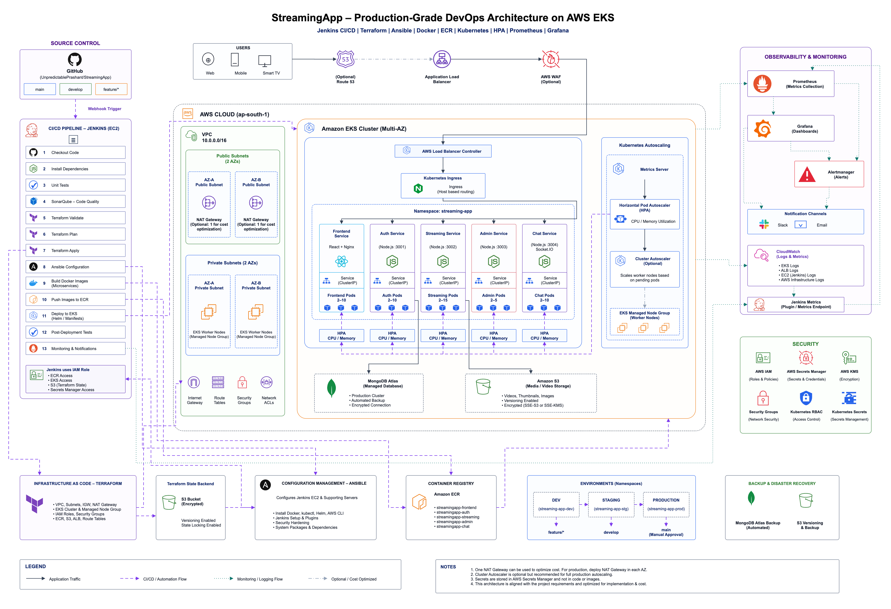

# StreamingApp architecture: design, creation steps, and connections

| Document field | Value |
| --- | --- |
| Project | Cloud Native DevOps Platform AWS — StreamingApp capstone |
| Last updated | 3 October 2026 |
| Status | Architecture documentation; infrastructure deployment is not verified by this document |
| AWS Region shown | `ap-south-1` |
| VPC CIDR shown | `10.0.0.0/16` |
| Diagram baseline | Commit `a535479` |
| Editable source | [StreamingApp-Production-DevOps-Architecture.drawio](../Architecture/StreamingApp-Production-DevOps-Architecture.drawio) |
| Image export | [StreamingApp-Production-DevOps-Architecture.png](../Architecture/StreamingApp-Production-DevOps-Architecture.png) |

## 1. Purpose and scope

This document explains the StreamingApp architecture, records how its editable diagram was produced, and describes the intended meaning of its connections. It provides material for the architecture chapter of the final capstone report and a sequence for recording implementation evidence as the project progresses.

The diagram combines source control, Jenkins delivery automation, AWS networking, Kubernetes workloads, scaling, storage, monitoring, security, and recovery. The repository currently contains the architecture artifacts and project overview; this document does not claim that Terraform, Jenkins, Kubernetes, or recovery tests have already been implemented or executed.

The image is for reading and presentation. The `.drawio` file is the editable source of truth. It contains **337 editable objects and 55 connectors**: 51 architecture, automation, or annotation connections and four legend examples. These counts include labels, icons, containers, and branch annotations; they are not counts of deployed AWS resources.

## 2. Architecture overview

Read the diagram in four passes:

1. **Application access:** users at the top reach the load-balancing and ingress area, then the five application services in the centre.
2. **Delivery automation:** GitHub and Jenkins on the left coordinate infrastructure provisioning, configuration, image creation, and deployment. Supporting tools are along the bottom.
3. **Scaling and operations:** autoscaling sits beside the workloads; monitoring and security occupy the right side.
4. **Persistence and recovery:** MongoDB Atlas and media storage sit below the workloads, with backup and recovery shown at the bottom right.

| Area | Components shown | Intended responsibility |
| --- | --- | --- |
| Source control | GitHub; `main`, `develop`, `feature/*` | Version code and initiate delivery through a webhook |
| CI/CD | Jenkins on EC2; 13 stages | Build, verify, provision, configure, publish, deploy, and report |
| Network | VPC; public and private subnets in two AZs; NAT gateways; internet gateway; route tables; security groups; network ACLs | Provide connectivity and network boundaries |
| Application entry | Web, mobile, smart TV; optional Route 53; ALB; optional AWS WAF; load balancer controller; ingress | Resolve the application name, protect entry traffic, and route requests |
| Compute | Multi-AZ EKS; managed node group; five services and their pods | Run the containerized application |
| Scaling | Metrics Server; service HPAs; optional Cluster Autoscaler | Adjust application replicas and worker capacity |
| Data | MongoDB Atlas; Amazon S3 media storage | Persist application data and media objects |
| Observability | Prometheus; Grafana; Alertmanager; Slack; email; CloudWatch; Jenkins metrics | Collect telemetry, visualize operation, and notify operators |
| Security | IAM; Secrets Manager; KMS; security groups; Kubernetes RBAC and Secrets | Define identities, permissions, secret handling, and encryption |
| Foundation | Terraform; S3 state backend; Ansible; ECR | Provision resources, track infrastructure state, configure hosts, and store images |
| Environments and recovery | DEV, STAGING, PRODUCTION; MongoDB Atlas backup; S3 versioning and backup | Promote releases and support restoration |

### 2.1 Application services

Replica ranges below are the design values written on the diagram, not measured running capacity. HPA thresholds, resource requests, and limits still need implementation decisions.

| Service | Stack / port shown | Kubernetes exposure | Pod range shown | Intended role |
| --- | --- | --- | --- | --- |
| Frontend | React + Nginx; port not specified | ClusterIP | 2–10 | Serve the user interface |
| Auth | Node.js, `3001` | ClusterIP | 2–10 | Handle authentication-related application functions |
| Streaming | Node.js, `3002` | ClusterIP | 2–15 | Handle streaming-related application functions and media access |
| Admin | Node.js, `3003` | ClusterIP | 2–5 | Provide administration functions |
| Chat | Node.js, `3004`, Socket.IO | ClusterIP | 2–10 | Provide real-time chat functions |

The diagram connects Auth to MongoDB Atlas and Streaming to S3. It does not define every backend-to-backend or backend-to-database dependency. Additional dependencies must be confirmed from application code before being documented as implemented connections.

### 2.2 Environments

| Environment | Namespace shown | Branch association shown | Promotion approach |
| --- | --- | --- | --- |
| DEV | `streaming-app-dev` | `feature/*` | Validate feature changes |
| STAGING | `streaming-app-stg` | `develop` | Run integration and release-readiness checks |
| PRODUCTION | `streaming-app-prod` | `main` | Require manual approval before deployment |

The centre's `Namespace: streaming-app` is a generic application grouping; the three environment-specific namespaces are listed separately. This diagram does not establish separate AWS accounts or clusters for the three environments.

## 3. Steps used to create and improve the diagram

| Step | Work performed | Result / rationale |
| --- | --- | --- |
| 1 | Reviewed the supplied architecture reference and its detailed component list | Established the required layout, labels, tools, services, and relationships |
| 2 | Created the `Architecture` folder and an editable draw.io file | Kept the diagram in the project repository |
| 3 | Built the major regions in the same composition as the reference | Source control and Jenkins on the left; AWS and EKS in the centre; operations on the right; supporting tools below |
| 4 | Added individual containers, text labels, icons, and service cards | Made the diagram editable without flattening the reference image |
| 5 | Used native draw.io AWS/Kubernetes shapes and embedded vector technology logos | Improved recognition while keeping objects independently selectable |
| 6 | Added the 13 pipeline stages, five services, HPAs, storage, environments, legend, and notes | Completed the reference's main content |
| 7 | Connected objects using real source/target references | Preserved attachment when individual components are moved |
| 8 | Inspected the later saved diagram, including its additional groups | Used the current edited file as the spacing-redesign baseline |
| 9 | Expanded the page to 3600 × 2460 diagram units and increased section/card spacing | Created room for labels, icons, and connection corridors |
| 10 | Routed long connections through gaps and standardized their styles | Made application, automation, monitoring, and optional paths distinguishable |
| 11 | Compared object IDs, labels, parents, and connection endpoints before and after the spacing change | Confirmed that all 337 objects and 55 connections were preserved |
| 12 | Parsed the XML, rendered the diagram, checked label widths and connector collisions, and exported a PNG | Produced the editable source and a presentation preview |
| 13 | Committed the diagram and PNG on `feature/aws-architecture` | Recorded the artifacts in commit `a535479`; [PR #1](https://github.com/sairamraavi/CloudNativeDevopsPlatformAWS/pull/1) was created targeting `develop` |

Approximate artwork was used for SonarQube, Slack, Alertmanager, user devices, email, and the Jenkins server symbol. These approximations affect icon appearance, not the associated labels or connections.

### 3.1 Approach for future diagram edits

1. Open the existing `.drawio` source and identify the affected group.
2. Move or resize the group with its children rather than rebuilding its contents.
3. Keep component names and logical relationships unchanged unless a design change has been approved.
4. Reserve clear space between neighbouring cards and around connector turns. Use top/bottom ports for vertical flows and side ports for flows between sections.
5. Route long edges around section contents; avoid lines across labels, icons, or unrelated cards. Crossings do not mean that two flows are joined.
6. Match the legend's line styles and arrow direction. Use separate paths for different destinations where shared routing would make the endpoint ambiguous.
7. Confirm each connector still has a valid source and target. For a layout-only edit, compare all IDs, labels, group parents, and endpoint pairs with the prior file.
8. Inspect the diagram at both overview and readable zoom, export a new PNG from the same source, and record the change in Git and this document.

## 4. Connection design and visual conventions

| Visual style | Colour in the current file | Meaning in the diagram |
| --- | --- | --- |
| Solid arrow | Slate `#334155` | Application traffic or a conceptual application/control relationship |
| Dashed arrow | Purple `#7C3AED` | CI/CD, provisioning, configuration, scaling control, or promotion |
| Dotted arrow | Teal `#0F766E` | Monitoring, telemetry, or notifications |
| Dash-dot arrow | Grey `#94A3B8` | Optional or cost-dependent relationship |

Architecture connectors use orthogonal paths. Legend examples are straight arrows. The file enables line jumps at crossings where supported by the viewer. A shared line segment can represent visual fan-out; the actual editable edges retain their individual targets.

The arrows describe architectural intent. They do not universally specify which process initiates a network connection. For example, the telemetry arrow points toward Prometheus, while a scrape is initiated by Prometheus. Several inherited solid arrows also depict configuration relationships rather than request traffic; the following sections distinguish them.

### 4.1 User access and ingress

The reference's visual sequence is **Users → Route 53 → ALB → WAF → AWS Load Balancer Controller → Ingress → services**. Preserve this sequence when discussing the drawing, but explain its operational meaning:

- Route 53 represents DNS resolution, not an HTTP proxy through which every application request passes.
- WAF represents a web ACL associated with the protected ALB, not a separate server hop. See [AWS WAF supported resources](https://docs.aws.amazon.com/waf/latest/developerguide/how-aws-waf-works-resources.html).
- The AWS Load Balancer Controller watches Kubernetes resources and configures load balancers; client traffic does not flow through the controller pod. See [AWS Load Balancer Controller](https://docs.aws.amazon.com/eks/latest/userguide/aws-load-balancer-controller.html).
- An Ingress describes routing rules and requires a corresponding controller implementation. The Nginx icon alone does not prove that an Nginx ingress controller has been deployed. See [Kubernetes Ingress](https://kubernetes.io/docs/concepts/services-networking/ingress/).

**Implementation decision still required:** choose ALB-based ingress routing or an explicitly configured ALB-to-Nginx arrangement. Record the Ingress class, target mode, TLS termination, host/path rules, and service target ports. Do not interpret the two controller symbols as a complete, already configured runtime chain.

### 4.2 Network boundaries and data access

Public subnets contain the NAT gateway representations, while private subnets contain the worker-node representations. The two AZ labels express the desired availability layout. The internet gateway, route tables, security groups, and network ACLs are shown as network controls; their individual rules and routes are not specified in the drawing.

Use the Auth → MongoDB Atlas edge to explain persistence access and the Streaming → S3 edge to explain media storage. Select database connectivity, bucket permissions, encryption settings, and outbound access during implementation. Record actual database ports, connection settings, and network restrictions from the chosen deployment configuration.

MongoDB Atlas and S3 are placed inside the diagram's large EKS outline for visual grouping. This does **not** mean that either service runs as an EKS pod. Likewise, the VPC and EKS boxes are visually adjacent; worker nodes must still be configured in the intended VPC subnets. One NAT gateway is shown as a cost option; the diagram's production note calls for a NAT gateway in each AZ.

### 4.3 Build, provision, and deploy

The delivery story is **GitHub webhook → Jenkins → validation and tests → infrastructure/configuration → image build → ECR → EKS deployment**. Terraform maintains infrastructure state in the separate S3 backend. Ansible uses provisioned host details to configure Jenkins and supporting servers. The state-backend-to-Ansible arrow is a dependency illustration: the state bucket does not execute Ansible.

The ECR → EKS arrow represents image availability and pulls. ECR does not initiate a deployment. Jenkins applies the desired deployment configuration; the cluster then obtains the referenced images. The IAM role card documents intended permissions, not an existing permission policy.

The state backend is intended to be encrypted, versioned, and locked. Locking must be explicitly configured; the current S3 backend supports `use_lockfile = true`. Confirm the project's Terraform version before adding the configuration. See [Terraform S3 backend](https://developer.hashicorp.com/terraform/language/backend/s3).

### 4.4 Pod and worker scaling

Metrics Server supplies resource metrics used by HPA. Each service's HPA adjusts its workload replica count within the range shown. CPU/memory utilization targets depend on appropriate resource requests and a working metrics API. The central HPA box and five HPA cards illustrate the mechanism and its per-service instances, not a requirement for six separate application HPAs. See [Horizontal Pod Autoscaling](https://kubernetes.io/docs/concepts/workloads/autoscaling/horizontal-pod-autoscale/).

The HPA → Cluster Autoscaler edge expresses a capacity dependency: additional pods can create demand for worker capacity. HPA does not call Cluster Autoscaler directly. Cluster Autoscaler responds to scheduling/capacity conditions and adjusts node groups. See [EKS Cluster Autoscaler](https://docs.aws.amazon.com/eks/latest/best-practices/cas.html).

### 4.5 Monitoring and alerts

Prometheus collects application, cluster, and Jenkins metrics; Grafana provides dashboards. Prometheus alert rules send alerts to Alertmanager, which routes notifications to receivers such as Slack or email. See [Prometheus alerting overview](https://prometheus.io/docs/alerting/latest/overview/).

Grafana → Alertmanager and Grafana → Notification Channels are retained from the reference. They represent an optional Grafana alerting arrangement and require explicit configuration if implemented. CloudWatch → Jenkins Metrics represents the overall observability grouping; CloudWatch does not automatically populate the Jenkins Prometheus endpoint. Configure Jenkins metric collection and CloudWatch logging separately.

The CloudWatch card lists ALB logs. Choose and document the actual delivery configuration: traditional ALB access logs are delivered to S3, and the current AWS documentation also describes enhanced CloudWatch Logs integration. Neither destination should be assumed enabled from the drawing alone. See [ALB access logging](https://docs.aws.amazon.com/elasticloadbalancing/latest/application/load-balancer-access-logs.html).

## 5. Jenkins pipeline steps to record

These are the 13 stages shown in the diagram. The evidence column describes what to capture when implementation is completed.

| Stage | Name in the diagram | Purpose and evidence to retain |
| --- | --- | --- |
| 1 | Checkout Code | Retrieve the intended branch; record the checked-out commit |
| 2 | Install Dependencies | Install application dependencies; retain the dependency/install result |
| 3 | Unit Tests | Verify application behaviour; retain the test summary |
| 4 | SonarQube – Code Quality | Run the configured analysis and gate; retain its result and dashboard link |
| 5 | Terraform Validate | Validate configuration; retain the command result |
| 6 | Terraform Plan | Review proposed infrastructure changes; retain the reviewed plan reference |
| 7 | Terraform Apply | Apply the approved infrastructure change; record resulting resource identifiers |
| 8 | Ansible Configuration | Configure provisioned hosts; retain the playbook summary |
| 9 | Build Docker Images (Microservices) | Build the five images; record their immutable tags or digests |
| 10 | Push Images to ECR | Publish images; retain the repository/image references |
| 11 | Deploy to EKS (Helm / Manifests) | Update workloads; record the namespace, release/version, and rollout result |
| 12 | Post-Deployment Tests | Exercise health and application paths; retain pass/fail evidence |
| 13 | Monitoring & Notifications | Verify telemetry and configured notifications; record the delivery result |

The ECR repositories shown are `streamingapp-frontend`, `streamingapp-auth`, `streamingapp-streaming`, `streamingapp-admin`, and `streamingapp-chat`.

## 6. Proposed implementation order and evidence log

This sequence is a future implementation plan, not a claim of completed deployment. Exact commands belong in the implementation documents after versions and configurations have been selected.

| Order | Work to implement | Evidence for the final report |
| --- | --- | --- |
| 1 | Resolve the design decisions in section 7 and identify the actual application repository | Approved decision notes and source commit |
| 2 | Bootstrap the S3 Terraform backend and initial automation access | Backend encryption/versioning/locking settings and access configuration |
| 3 | Define VPC, AZs, subnets, routes, NAT, and network controls in Terraform | Reviewed plan, apply result, subnet and route evidence |
| 4 | Provision the EKS cluster, managed nodes, ECR repositories, and required IAM roles | Resource outputs and ready-node evidence |
| 5 | Bootstrap Jenkins EC2 and use Ansible to configure Jenkins and supporting tools | Host configuration record and playbook results |
| 6 | Configure GitHub integration, Jenkins credentials/roles, and pipeline stages | Webhook delivery and first pipeline-run evidence |
| 7 | Configure the chosen ingress implementation, namespaces, services, and workload manifests | Ingress rules, service definitions, successful route checks |
| 8 | Configure MongoDB Atlas, S3 media access, and secret delivery to workloads | Redacted connection checks and application read/write tests |
| 9 | Build/publish the five images and deploy to DEV | Image digests, rollout status, and application test results |
| 10 | Configure Metrics Server, five HPAs, and optional worker autoscaling | Resource metrics plus before/after replica and node observations |
| 11 | Configure Prometheus, Grafana, Alertmanager, CloudWatch, and receivers | Healthy targets, dashboards, a controlled alert, and log examples |
| 12 | Validate STAGING and the manual PRODUCTION promotion gate | Promotion record, approved version, and post-deployment tests |
| 13 | Verify backup, restore, failure recovery, and rollback procedures | Restore test, measured recovery times, and rollback evidence |
| 14 | Refresh the diagram and compile the final capstone report | Matching diagram/PNG, documentation commit, and evidence links |

Jenkins requires an initial bootstrap before it can provision or configure its own supporting infrastructure. Document which first-time steps are performed from the operator environment and which subsequent steps are automated by the pipeline.

## 7. Design decisions still to confirm

| Topic | Current diagram / documentation position | Record before declaring implementation complete |
| --- | --- | --- |
| Application repository | Diagram label is `UnpredictablePrashant/StreamingApp`; this repository is `sairamraavi/CloudNativeDevopsPlatformAWS` | Confirm whether these are separate application/platform repositories or whether the source label needs a later approved change |
| Ingress and TLS | ALB, load balancer controller, Nginx icon, and optional WAF are all shown | Controller ownership, Ingress class, target mode, certificates, listener ports, and routing rules |
| Infrastructure ownership | Terraform lists ALB resources while the load balancer controller can also create them | Assign ownership per resource; avoid managing the same ALB through both Terraform and a controller |
| Jenkins host | EC2 is named, but its subnet and administrative access are not detailed | Host placement, access method, bootstrap steps, and least-privilege policies |
| Secrets | Secrets Manager and Kubernetes Secrets are both shown | How secrets reach pods, which identities may retrieve them, and how rotation is handled |
| Scaling | Replica ranges are provided; thresholds and node sizes are absent | Requests/limits, HPA metrics/thresholds, node types, capacity bounds, and scaling tests |
| Database and media | MongoDB Atlas and encrypted/versioned S3 are design targets | Network connectivity, authorization, backup settings, and tested read/write access |
| Environment separation | Namespaces and branch mappings are shown | Isolation controls, resource quotas, promotion checks, and production approval ownership |
| Observability | Several arrows are conceptual | Actual scrape endpoints, alert ownership, log destinations, retention, and notification configuration |
| Recovery | Atlas backup and S3 versioning/backup are shown | Retention, restore procedure, recovery point/time targets, and restore-test results; versioning alone is not a complete recovery plan |
| Availability and cost | Two AZs and optional components are shown | NAT choice, optional component decisions, failure tests, and a measured cost estimate |

## 8. Validation and final-report checklist

The architecture preparation established the editable file, checked XML and endpoint references, and visually validated the spacing redesign. Before the final submission:

- [ ] Ensure the PNG is exported from the exact `.drawio` revision being submitted.
- [ ] Recheck labels, group boundaries, arrowheads, and readability at presentation size.
- [ ] Reconcile each conceptual relationship with its actual deployment configuration.
- [ ] Link implementation documents and evidence for each pipeline stage.
- [ ] Record successful application, database, media, and real-time chat tests.
- [ ] Record HPA behaviour and, if enabled, node scaling behaviour under controlled load.
- [ ] Record an alert-delivery test and verify the chosen log destinations.
- [ ] Record production approval, rollback, backup, and restore tests.
- [ ] Add the final source commit and update the change log below.

### 8.1 Document change log

| Date | Change | Evidence / status |
| --- | --- | --- |
| 3 October 2026 | Documented the current diagram, creation workflow, connection approach, and implementation plan | Based on the checked-in architecture artifacts at `a535479`; deployment evidence pending |

## 9. Complete connection register

This register lists every connector currently in the editable file. The IDs allow an exact comparison during later diagram maintenance. Arrow direction is recorded as drawn; the interpretation column explains conceptual relationships where needed. The four legend connectors and three namespace-to-branch annotation connectors are included for completeness.

| Connector ID | Direction as drawn | Style | Interpretation |
| --- | --- | --- | --- |
| `waf-to-controller` | AWS WAF → AWS Load Balancer Controller | Solid | Conceptual entry/control relationship; WAF protects the ALB and does not forward requests to the controller pod. |
| `terraform-provision` | Terraform → VPC | Dashed | Terraform provisions the represented network infrastructure. |
| `pipeline-ansible` | Jenkins stage 8: Ansible Configuration → Ansible | Dashed | Jenkins invokes configuration automation. |
| `ansible-jenkins` | Ansible → Jenkins IAM role card | Dashed | Ansible configures the Jenkins host; the role card is the retained diagram endpoint. |
| `docker-ecr` | Jenkins stage 9: Build Docker Images (Microservices) → Amazon ECR | Dashed | Build output is published to the container registry. |
| `pipeline-ecr` | Jenkins stage 10: Push Images to ECR → Amazon ECR | Dashed | The push stage publishes image artifacts to ECR. |
| `pipeline-eks` | Jenkins stage 11: Deploy to EKS (Helm / Manifests) → Amazon EKS cluster | Dashed | The deployment stage applies the desired Kubernetes release. |
| `ecr-eks` | Amazon ECR → Amazon EKS cluster | Dashed | The cluster obtains images from ECR; the arrow is not an ECR-initiated deployment. |
| `jenkins-metrics-flow` | Jenkins stage 13: Monitoring & Notifications → Jenkins Metrics | Dotted | The pipeline monitoring stage relates to Jenkins telemetry collection. |
| `github-webhook` | GitHub / source control → Jenkins pipeline | Dashed | Repository events trigger the configured Jenkins job. |
| `users-route53` | Users → Route 53 | Solid | DNS resolution for application access; not an HTTP forwarding hop. |
| `route53-alb` | Route 53 → Application Load Balancer | Dash-dot | Optional application DNS naming points clients to the load balancer. |
| `alb-waf` | Application Load Balancer → AWS WAF | Solid | Logical web ACL protection association, not a separate downstream proxy. |
| `hpa-to-frontend` | Frontend HPA → Frontend Service | Dashed | The service HPA controls its workload replica count. |
| `hpa-to-auth` | Auth HPA → Auth Service | Dashed | The service HPA controls its workload replica count. |
| `hpa-to-streaming` | Streaming HPA → Streaming Service | Dashed | The service HPA controls its workload replica count. |
| `hpa-to-admin` | Admin HPA → Admin Service | Dashed | The service HPA controls its workload replica count. |
| `hpa-to-chat` | Chat HPA → Chat Service | Dashed | The service HPA controls its workload replica count. |
| `controller-ingress` | AWS Load Balancer Controller → Kubernetes Ingress | Solid | The controller reconciles routing resources; the drawing is not a literal packet path. |
| `ingress-frontend` | Kubernetes Ingress → Frontend Service | Solid | Ingress routing directs the appropriate requests to this service. |
| `ingress-auth` | Kubernetes Ingress → Auth Service | Solid | Ingress routing directs the appropriate requests to this service. |
| `ingress-streaming` | Kubernetes Ingress → Streaming Service | Solid | Ingress routing directs the appropriate requests to this service. |
| `ingress-admin` | Kubernetes Ingress → Admin Service | Solid | Ingress routing directs the appropriate requests to this service. |
| `ingress-chat` | Kubernetes Ingress → Chat Service | Solid | Ingress routing directs the appropriate requests to this service. |
| `metrics-hpa` | Metrics Server → Horizontal Pod Autoscaler | Solid | Resource metrics support the HPA scaling calculation. |
| `hpa-cluster-autoscaler` | Horizontal Pod Autoscaler → Cluster Autoscaler | Solid | More replicas can create capacity demand; no direct HPA-to-autoscaler API call is implied. |
| `autoscaler-workers` | Cluster Autoscaler → EKS Managed Node Group | Dash-dot | Optional worker-capacity adjustment through the configured node group. |
| `master-hpa-frontend` | Horizontal Pod Autoscaler → Frontend HPA | Dashed | Conceptual fan-out from the common HPA mechanism to this service HPA. |
| `master-hpa-auth` | Horizontal Pod Autoscaler → Auth HPA | Dashed | Conceptual fan-out from the common HPA mechanism to this service HPA. |
| `master-hpa-streaming` | Horizontal Pod Autoscaler → Streaming HPA | Dashed | Conceptual fan-out from the common HPA mechanism to this service HPA. |
| `master-hpa-admin` | Horizontal Pod Autoscaler → Admin HPA | Dashed | Conceptual fan-out from the common HPA mechanism to this service HPA. |
| `master-hpa-chat` | Horizontal Pod Autoscaler → Chat HPA | Dashed | Conceptual fan-out from the common HPA mechanism to this service HPA. |
| `app-db` | Auth Service → MongoDB Atlas | Solid | Auth application data access to MongoDB Atlas. |
| `app-media` | Streaming Service → Amazon S3 media storage | Solid | Streaming application access to media objects in S3. |
| `prometheus-grafana` | Prometheus → Grafana | Dotted | Metrics are available to Grafana dashboards; Grafana queries the configured data source. |
| `grafana-alertmanager` | Grafana → Alertmanager | Dotted | Optional configured Grafana alert forwarding; not an automatic dashboard behaviour. |
| `prometheus-alerts` | Prometheus → Alertmanager | Dotted | Prometheus sends firing/resolved alert state to Alertmanager. |
| `alerts-notifications` | Alertmanager → Notification Channels | Dotted | Alertmanager routes notifications to configured receivers. |
| `grafana-notifications` | Grafana → Notification Channels | Dotted | Optional Grafana-managed notifications, if explicitly configured. |
| `cw-jenkins-metrics` | CloudWatch → Jenkins Metrics | Dotted | Conceptual observability relationship; Jenkins metrics and CloudWatch logs need separate configuration. |
| `eks-prometheus` | Amazon EKS cluster → Prometheus | Dotted | Cluster/application metrics collection; Prometheus initiates scrapes where configured. |
| `eks-cloudwatch` | Amazon EKS cluster → CloudWatch | Dotted | Cluster telemetry/log delivery through the configured logging integration. |
| `metrics-prometheus` | Jenkins Metrics → Prometheus | Dotted | Jenkins exposes metrics for Prometheus collection; configure the scrape endpoint. |
| `branch-to-env-dev` | DEV → feature/* annotation | Dashed | Branch association annotation; no network traffic is implied. |
| `branch-to-env-staging` | STAGING → develop annotation | Dashed | Branch association annotation; no network traffic is implied. |
| `branch-to-env-production` | PRODUCTION → main / manual approval annotation | Dashed | Branch association annotation; no network traffic is implied. |
| `legend-edge-app` | app legend start → app legend end | Solid | Visual legend example only; not an application relationship. |
| `legend-edge-auto` | auto legend start → auto legend end | Dashed | Visual legend example only; not an application relationship. |
| `legend-edge-monitor` | monitor legend start → monitor legend end | Dotted | Visual legend example only; not an application relationship. |
| `legend-edge-optional` | optional legend start → optional legend end | Dash-dot | Visual legend example only; not an application relationship. |
| `terraform-state` | Terraform → Terraform State Backend | Dashed | Terraform reads/writes infrastructure state using the S3 backend. |
| `state-ansible` | Terraform State Backend → Ansible | Dashed | Provisioning-to-configuration dependency; the state backend does not run Ansible. |
| `dev-staging` | DEV → STAGING | Dashed | Promote a verified application version to STAGING. |
| `staging-prod` | STAGING → PRODUCTION | Dashed | Promote to PRODUCTION using the manual approval policy shown. |
| `pipeline-terraform` | Jenkins stage 7: Terraform Apply → Terraform | Dashed | Jenkins executes the infrastructure apply stage. |
